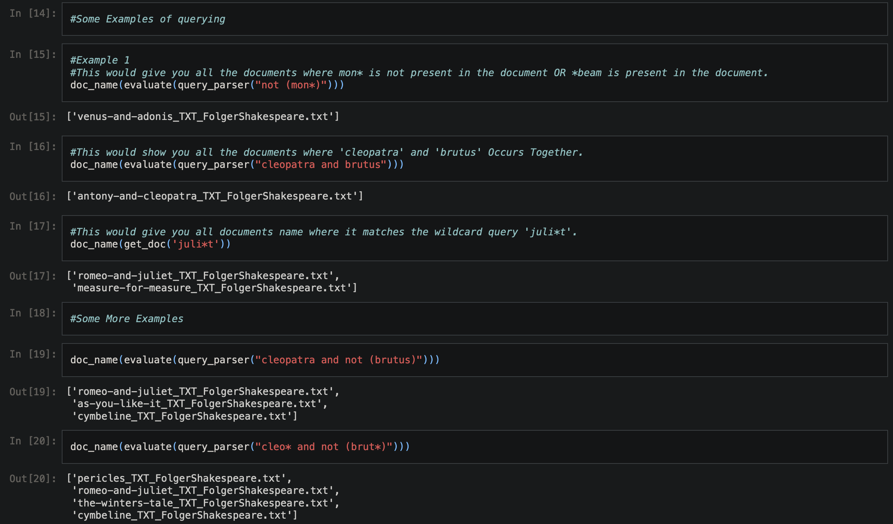

# Boolean Retrieval System
## Project Description - 

This project is aimed at designing and developing Boolean Information Retrieval System, i.e. to return those documents (specifically their names from corpus/dataset given, which satisfy Boolean (AND, OR and NOT with their combinations).

The Boolean Information Retrieval System should include the following features / pre-processing
steps:
- Stopword Removal: Remove the common stop words from the corpus.
- Stemming or Lemmatization: Employ either one of the techniques for normalisation.
- Wildcard Query Handling: Any one of the techniques among Permuterm or K-Gram index should be used for wildcard query management.
- Spelling Correction: Edit Distance Method should be employed to correct misspelled words.

